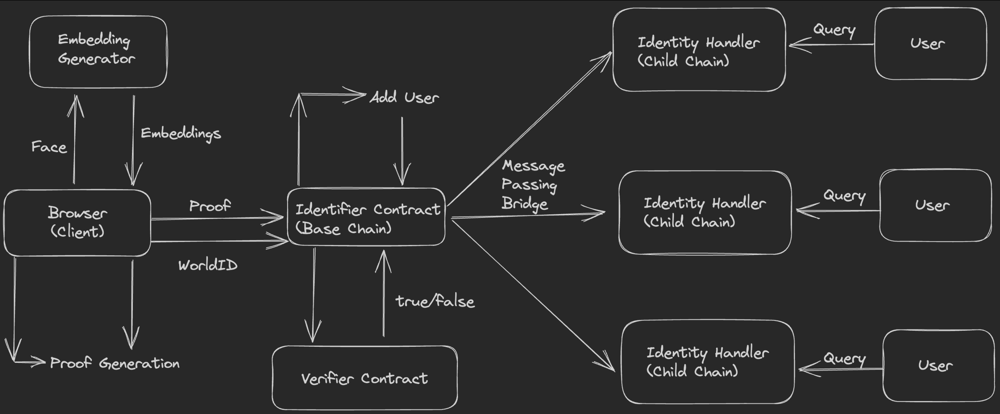

# Sapien

## Description

### Introducing Sapien

Sapien is a decentralized identity platform that seamlessly associates a human identity with a blockchain address without revealing any sensitive information. Sapien addresses several critical challenges faced by traditional identity systems and existing blockchain-based identity solutions.

### Key Advantages:

1. **Mitigation of Sybil Attacks**: Sapien employs ZKML to do off-chain authentication of human face and posts the proof on-chain for verification. The method ensures a human identity behind an address through cryptographic security. Sybil attacks occur when a single user creates multiple identities to manipulate or exploit a system. By linking each human identity to a unique blockchain address, Sapien ensures that one person is represented by only one verifiable identity, safeguarding the integrity of the platform.
2. **Soul Bound Tokens**: These tokens are intricately linked to a verified human identity and cannot be transferred to another individual. They can only be transferred to another address linked to the same human identity. This unique feature opens up new possibilities in features like GitPOAP which can allow the current non-transferrable credential to be transferable between addresses linked to same human identity.
3. **Decentralized KYC (Know Your Customer)**: One of the most significant advantages of Sapien is its ability to facilitate decentralized KYC processes. Traditional KYC methods often involve sharing sensitive personal information with centralized authorities, raising concerns about data privacy and security.
4. **Privacy-Centric Authentication**: Unlike existing solutions that might compromise user privacy by requesting authentication videos or other intrusive data, Sapien focuses on privacy-centric authentication methods. The platform employs ZK protocols to validate human identity without compromising sensitive information. This ensures that users have peace of mind knowing that their data remains secure and protected.

## Architecture

## Contract Addresses

* Identifier Contract (Polygon): `0xdd767c6dD29570549CcF948a00527c5d7ee27dB5`
* Celo Handler Contract: `0xB00D5cc55162741F9a680F16D430eD07067aFd0C`

